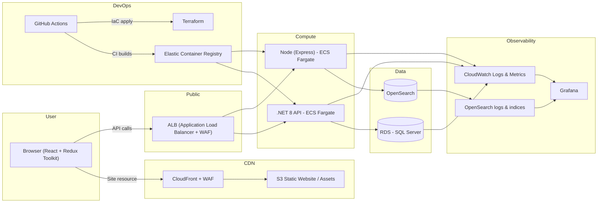

# MLN Project

The MLN project is a comprehensive solution designed to manage e-commerce operations. It includes a backend for handling API requests, a frontend for user interaction, and integrations with Elasticsearch for advanced data querying. The project is modular, with each component serving a specific role in the system.

---

# MLN Solution Overview

The MLN solution consists of multiple projects, each serving a specific purpose in the overall system. Below is a breakdown of each project and its functionality:

## 1. **Node.js Backend**

- **Location**: `node-backend/`
- **Purpose**:
  - Acts as a backend service for handling API requests.
  - Handles saving orders.
  - Includes routes for managing orders and integrates with Elasticsearch for order data.
  - Swagger is used for API documentation.
- **Key Files**:
  - `src/app.js`: Main entry point for the Node.js backend.
  - `src/routes/order.js`: Handles order-related API routes.
  - `src/elastic/order-mapping.json`: Elasticsearch mapping for orders.
  - `src/swagger.js`: Swagger configuration for API documentation.
- **How to Install**:
  1.  Install dependencies:
      ```powershell
      npm install --prefix node-backend
      ```
- **How to Run**:
  1.  Start the backend using `nodemon`:
      ```powershell
      npm start --prefix node-backend
      ```

## 2. **.NET Backend**

- **Location**: `dotnet-backend/`
- **Purpose**:
  - Provides a backend service built with .NET.
  - Manages categories and products (create and get) using a database.
  - Includes migrations for database schema management and seed data.
- **Key Files**:
  - `Program.cs`: Main entry point for the .NET backend.
  - `Controllers/`: Contains controllers for handling API requests (e.g., `CategoriesController.cs`).
  - `Data/AppDbContext.cs`: Database context for managing data access.
  - `Migrations/`: Contains database migration files.
- **How to Install**:
  1.  Restore dependencies:
      ```powershell
      dotnet restore dotnet-backend
      ```
  2.  Apply database migrations:
      ```powershell
      dotnet ef database update --project dotnet-backend
      ```
- **How to Run**:
  1.  Start the backend in watch mode:
      ```powershell
      dotnet watch run --project dotnet-backend
      ```

## 3. **Proxy Server**

- **Location**: `proxy/`
- **Purpose**:
  - Acts as a reverse proxy to route requests to the appropriate backend services. Simulates Load Balancer behavior with rules for development purposes.
- **Key Files**:
  - `proxy.js`: Main entry point for the proxy server.
- **How to Install**:
  1.  Install dependencies:
      ```powershell
      npm install --prefix proxy
      ```
- **How to Run**:
  1.  Start the proxy server using `nodemon`:
      ```powershell
      npm start --prefix proxy
      ```

## 4. **Client**

- **Location**: `client/`
- **Purpose**:
  - Frontend application built with React and Redux Toolkit.
  - Provides a user interface for interacting with the system.
- **Key Files**:
  - `src/main.jsx`: Main entry point for the React application.
  - `src/components/`: Contains reusable React components.
  - `src/features/`: Contains Redux slices for state management.
- **How to Install**:
  1.  Install dependencies:
      ```powershell
      npm install --prefix client
      ```
- **How to Run**:
  1.  Start the development server:
      ```powershell
      npm run dev --prefix client
      ```

## 5. **Elasticsearch Service**

- **Location**: `.vscode/elasticsearch run.ps1`
- **Purpose**:
  - Powers Elasticsearch for managing and querying order data.
- **How to Run**:
  1.  Execute the PowerShell script:
      ```powershell
      powershell -File .vscode/elasticsearch run.ps1
      ```

---

# Running All Services Together

To run all services together, you can use the predefined tasks in the workspace:

1. **Run All Services**:

   - This task starts all the services (Node.js backend, .NET backend, Proxy server, Elasticsearch, and Client).
   - To execute this task:
     ```powershell
     echo Starting all services...
     ```

2. **Individual Tasks**:
   - You can also start each service individually using the tasks defined in the workspace.

---

# Installation Instructions

## Prerequisites

1. Ensure you have the following installed:
   - Node.js
   - SQL Server
   - .NET SDK
   - Elasticsearch

## Setting Up the Database

1. Open a terminal and navigate to the `dotnet-backend` directory:
   ```powershell
   cd dotnet-backend
   ```
2. Create the database using Entity Framework Core:
   ```powershell
   dotnet ef database update
   ```

## Elasticsearch Setup

1. Run the `elasticsearch install.ps1` script to create the `orders` index:
   ```powershell
   powershell -File .vscode/elasticsearch install.ps1
   ```
   - Note: The mapping file used for the `orders` index can be found at `node-backend/src/elastic/order-mapping.json`.

---

## Deployment with Terraform

The MLN project includes a Terraform-based deployment setup to provision and manage the required infrastructure. This ensures a consistent and repeatable deployment process.

### Key Features of the Deployment

- **Infrastructure as Code (IaC)**: All infrastructure is defined using Terraform.
- **Modular Design**: The Terraform configuration is divided into modules for backend, frontend, and shared resources.
- **LocalStack Integration**: The deployment is designed to work with LocalStack for local AWS service emulation. (Note: Some AWS services may not be fully supported in LocalStack so couldn't test it's working properly.)

## Automated Deployment Script

The MLN project includes an automated deployment script (`deploy.ps1`) to streamline the process of building, packaging, and deploying the application components. This script leverages Docker and Terraform to ensure a consistent and efficient deployment.

### Key Features

- **Docker Image Creation**: Builds Docker images for the Node.js backend, .NET backend, and React frontend.
- **Container Registry Integration**: Pushes the Docker images to a local Docker registry.
- **Terraform Orchestration**: Initializes and applies Terraform configurations to provision the infrastructure.
- **S3 Integration**: Ensures the S3 bucket exists and uploads the React frontend to it.

### Deployment Steps

1. **Run the Deployment Script**:
   Execute the `deploy.ps1` script from the `scripts` directory:

   ```powershell
   powershell -File scripts/deploy.ps1
   ```

2. **What the Script Does**:
   - Builds Docker images for all components.
   - Pushes the images to a local Docker registry.
   - Initializes and applies Terraform configurations.
   - Uploads the React frontend to an S3 bucket.

---

# Architecture Diagram



---

# Component Explanations & Rationale

### Frontend

- **Technology**: React app with Redux Toolkit hosted on S3, cached via CloudFront + WAF.
- **Purpose**: Provides a responsive and interactive user interface for the MLN system.

### Products Service (.NET 8)

- **Technology**: Runs on ECS Fargate, connects to RDS (SQL Server).
- **Purpose**: Exposes product and category APIs for the frontend and other services.

### Order Service (Node - NestJS/Express)

- **Technology**: Runs on ECS Fargate, connects to OpenSearch.
- **Purpose**: Validates and stores orders into OpenSearch for querying and analytics.

### Data Stores

- **RDS**: Stores categories and products.
- **OpenSearch**: Stores and indexes orders for fast querying and analytics.

# DevOps, Security, Monitoring & Autoscaling Architecture

## DevOps

**Tools**

- GitHub Actions for CI/CD
- Terraform for Infrastructure as Code (IaC)

**Process**

- On every commit to main branch:
  - GitHub Actions builds Docker images
  - Pushes images to Amazon ECR
  - Applies Terraform to update ECS services

**Automation**

- Full environment provisioning via Terraform
- No manual setup required
- Supports multiple environments (Development, Production)

**Rollback**

- Terraform state management
- Versioned Docker images enable quick rollback

---

## Security

**VPC Segregation**

- Public subnets for ALB
- Private subnets for ECS tasks
- Isolated subnets for databases

**IAM Roles**

- Granular least-privilege access
- Roles for ECS tasks, GitHub Actions, and Terraform

**Secrets Management**

- AWS Secrets Manager for DB credentials, Elasticsearch endpoints, and API keys

**WAF & Shield**

- Protects ALB from common attacks (SQL injection, XSS, DDoS)

**Encryption**

- RDS and OpenSearch encrypted at rest with KMS
- TLS enforced for data in transit

---

## Monitoring

**CloudWatch**

- Metrics, logs, and alarms for ECS, RDS, ALB, and Lambda

**Grafana**

- Unified dashboards pulling from CloudWatch and OpenSearch

**OpenSearch Dashboards**

- Detailed query and indexing performance monitoring

**Alerts**

- Integrated with SNS and Slack for proactive notifications

---

## Autoscaling

**ECS Service AutoScaling**

- Scales containers based on CPU, memory, or custom CloudWatch metrics (e.g., request latency)

**RDS Scaling**

- Multi-AZ deployment
- Read replicas
- Storage auto-scaling

**OpenSearch Scaling**

- Auto-scaled data nodes and dedicated master nodes
- Storage tiering enabled

**CloudFront Caching**

- Reduces backend load

---

# Running Version

Working version of the MLN project can be found [here](https://unprofessorially-positivistic-dan.ngrok-free.app/). (if not working you can ping me at 054-6544028)
